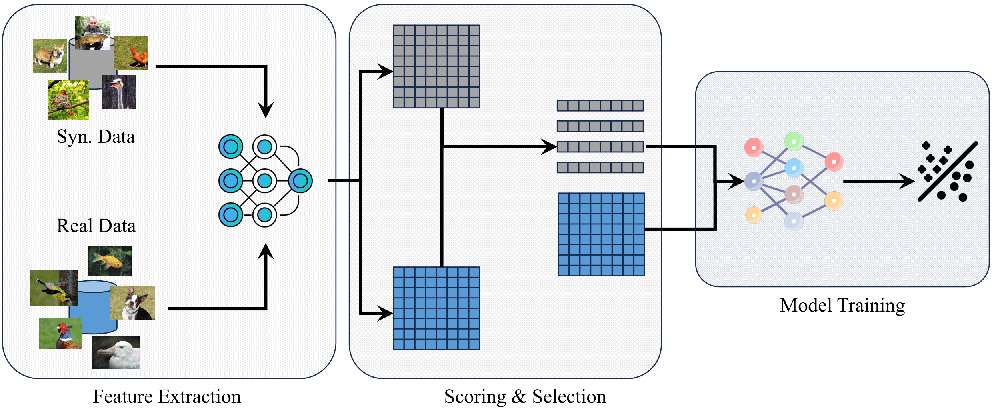

In this repository, we provide the code for the paper: **Balancing Fidelity and Diversity: Synthetic data could stand on the shoulder of the real in visual recognition**.

In the overall pipeline, we first extract image features and compute a score for each synthetic image based on these features. After scoring, we select synthetic samples accordingly and use them to train the target models.

In this repository, we provide the code for feature extraction, scoring, and selection stages of the overall pipeline. For downstream model training, we adapt code from public repositories such as [timm](https://github.com/rwightman/pytorch-image-models).

